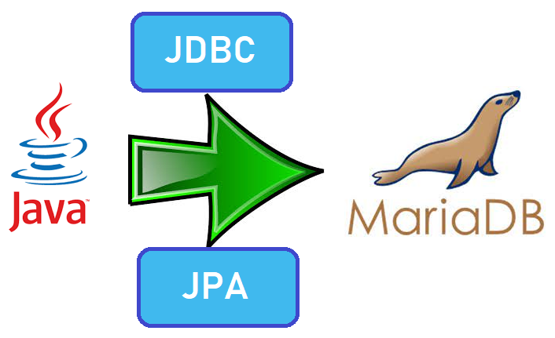
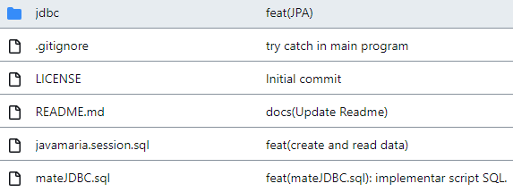
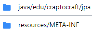
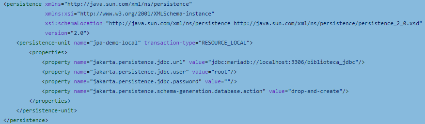
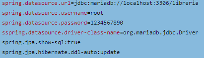

# Conexión con una base de datos MariaDB con Java usando JDBC y JPA



# Introducción

En el siguiente repositorio vamos a mostrar una conexión simple con la base de datos usando las dos formas distintas de JDBC, una normal y la otra conexión Pool. Después implementaremos una APIREST utilizando JPA. Para ello vamos a crear un proyecto utilizando el framework [Spring Boot](https://start.spring.io/) para Java.

JPA y JDBC son dos tecnologías diferentes que se utilizan para acceder a bases de datos desde una aplicación Java.

JDBC (Java Database Connectivity) es una API de Java que proporciona un conjunto de clases e interfaces para interactuar con una base de datos relacional. JDBC se usa para escribir consultas SQL, ejecutarlas y obtener resultados de la base de datos. Con JDBC, el programador tiene un control completo sobre la interacción con la base de datos y debe escribir todas las consultas SQL manualmente.

Por otro lado, JPA (Java Persistence API) es una especificación de Java que proporciona un conjunto de clases e interfaces para trabajar con bases de datos relacionales de manera más fácil y eficiente. JPA es una capa de abstracción que oculta los detalles de la base de datos subyacente y permite al programador interactuar con los objetos Java en lugar de con la base de datos. JPA usa un ORM (Object-Relational Mapping) para mapear los objetos Java a tablas en la base de datos y viceversa, lo que significa que el programador no tiene que escribir consultas SQL manualmente.

En resumen, la principal diferencia entre JDBC y JPA es que JDBC es una API para interactuar con la base de datos directamente, mientras que JPA es una capa de abstracción que emplea un ORM para mapear los objetos Java a la base de datos. JPA es más fácil de usar y más eficiente que JDBC, pero JDBC ofrece un mayor control sobre la interacción con la base de datos.

Por ello puedes encontrar una versión de nuestro trabajo JDBC en la rama [pool](https://github.com/Adrianlm17/Mate_JDBC/tree/pool), otra versión del trabajo utilizando JPA en la rama [JPA](https://github.com/Adrianlm17/Mate_JDBC/tree/JPA) y por último, en la rama [principal](https://github.com/Adrianlm17/Mate_JDBC/tree/main) usamos todos esos desarrollos previos para implementar una APIREST apoyandonos en Spring.

# Índice

- [Instalación](#instalación)
- [Base de datos](#base-de-datos)
- [Uso](#uso)
    - [JDBC](#jdbc)
    - [JPA](#jpa)
    - [API JPA](#api-jpa)
- [Requisitos](#requisitos)
- [Mejoras](#mejoras)

# Instalación

1. Descargar e instalar [Maven](https://maven.apache.org/download.cgi) en el sistema. Puede hacerse siguiendo las instrucciones en el sitio web oficial de Apache Maven.

2. Clonar el repositorio remoto que contiene el proyecto Maven utilizando una herramienta de control de versiones como [Git](https://git-scm.com/). Para ello, se debe ejecutar el siguiente comando en la línea de comandos:

```
git clone url_del_repositorio
```

2. Navegar al directorio raíz del proyecto Maven clonado usando la línea de comandos.

3. Ejecutar el siguiente comando Maven para construir el proyecto:

```
mvn clean install
```

4. Este comando compila el código fuente del proyecto, empaqueta el proyecto en un archivo *.jar* y lo instala en el repositorio local de Maven.

5. Si el proyecto depende de otras bibliotecas de terceros, Maven descarga automáticamente las bibliotecas necesarias del repositorio remoto y las agrega al proyecto.

# Base de datos

A continuación explicaremos el archivo [mateJDBC.sql](https://github.com/Adrianlm17/Mate_JDBC/blob/JPA/mateJDBC.sql), el cual contiene la estructurá de la base de datos que hemos usado como modelo.

1. Primero de todo creamos la base de datos "biblioteca_jdbc" en el caso de que no existirá ya:

```
CREATE DATABASE IF NOT EXISTS `biblioteca_jdbc`;
```

2. Usábamos la base de datos anteriormente mencionada:

```
USE `biblioteca_jdbc`;
```

3. Una vez estábamos dentro de nuestra base de datos, creamos la primera tabla, la cual contenía la información de los autores:

```
CREATE TABLE `autor` (

  autor_id INT NOT NULL AUTO_INCREMENT PRIMARY KEY,
  nombre VARCHAR(255) NOT NULL,
  nacionalidad VARCHAR(255) NOT NULL
);
```

4. Después creamos la tabla biblioteca, la cual nos permite almacenar las bibliotecas con sus respectivas direcciones:

```
CREATE TABLE biblioteca (

  biblioteca_id INT NOT NULL AUTO_INCREMENT PRIMARY KEY,
  nombre VARCHAR(255) NOT NULL,
  direccion VARCHAR(255) NOT NULL
);
```

5. Una vez creada la tabla biblioteca, creamos la tabla categoría libro, la cual nos permite identificar y agrupar los libros por categorías:

```
CREATE TABLE categoria_libro (

  categoria_id INT NOT NULL AUTO_INCREMENT PRIMARY KEY,
  nombre VARCHAR(255) NOT NULL
);
```

6. Ahora vamos a crear la tabla editorial, la cual nos permite obtener más información de cada libro:

```
CREATE TABLE editorial (

  editorial_id INT NOT NULL AUTO_INCREMENT PRIMARY KEY,
  nombre VARCHAR(255) NOT NULL,
  direccion VARCHAR(255) NOT NULL
);
```

7. Por último, pero no menos importante, vamos a crear la tabla libros, la cual nos permite tener su respectiva información con sus respectivas relaciones:

```
CREATE TABLE libros (

  libro_id INT NOT NULL AUTO_INCREMENT PRIMARY KEY,
  titulo VARCHAR(255) NOT NULL,
  fecha_publicacion DATE NOT NULL,
  isbn VARCHAR(255) NOT NULL,
  categoria_id INT NOT NULL,
  editorial_id INT NOT NULL,
  FOREIGN KEY (categoria_id) REFERENCES categoria_libro (categoria_id),
  FOREIGN KEY (editorial_id) REFERENCES editorial (editorial_id)
);
```

# Uso

A continuación vamos a explicar como utilizar cada apartado para poder usarlo sin ningún tipo de problema o inconveniente:

## JDBC

Si hemos llegado hasta este apartado significa que ya tenemos preparado todo he instalado, solo nos faltara entender como funciona, para posteriormente ser usado. 

Antes de poder hacer uso de nuestro App, tendremos que dirigirnos a nuestro archivo [ConnectionService](https://github.com/Adrianlm17/Mate_JDBC/blob/pool/jdbc/src/main/java/edu/craptocraft/programjdbc/ConnectionService.java), el cual tendremos que modificar los siguientes elementos:

- URL
- Usuario
- Contraseña

En nuestro caso lo tenemos así:

```
globalConnection = DriverManager.getConnection(

                "jdbc:mariadb://localhost:3306/biblioteca_JDBC",
                "root", "1234567890");
```

De esta forma guardamos en la variable "globalConnection" la configuración que nos permitirá conectarnos a nuestra base de datos.

Una vez tenemos configurado dicho archivo, Tendremos que realizar la misma configuración en el archivo [ConnectionServicePool](https://github.com/Adrianlm17/Mate_JDBC/blob/pool/jdbc/src/main/java/edu/craptocraft/programjdbc/ConnectionServicePool.java), en nuestro caso lo tenemos de la siguiente manera:

```
dataSource = new HikariDataSource();
dataSource.setJdbcUrl("jdbc:mariadb://localhost:3306/biblioteca_JDBC");
dataSource.setUsername("root");
dataSource.setPassword("1234567890");
```

Por último, pero no menos importante, solo tendremos que configurar nuestros archivos [CRUD](https://github.com/Adrianlm17/Mate_JDBC/blob/pool/jdbc/src/main/java/edu/craptocraft/programjdbc/Crud.java) y [CrudPool](https://github.com/Adrianlm17/Mate_JDBC/blob/pool/jdbc/src/main/java/edu/craptocraft/programjdbc/CrudPool.java), en función de las querys y uso que queramos realizar.

Una vez tenemos esos archivos configurados, nos dirigiremos a nuestro archivo [App](https://github.com/Adrianlm17/Mate_JDBC/blob/pool/jdbc/src/main/java/edu/craptocraft/App.java) y tendremos que añadir las querys necesarias en función de nuestras necesidades. Cuando ya tengamos todo, podremos ejecutar dicho archivo.

## JPA

Cuando ya tenemos preparado todo el entorno y nos encontramos en la rama "JPA", veremos que nos aparecen los siguientes archivos y carpetas, como muestra la siguiente imagen:



Si entramos dentro de la carpeta "jdbc", nos aparecerá una carpeta "src/main" y el pom.xml, el cual ha sido configurado con las respectivas dependencias que necesitamos para utilizar JPA. 

Cuando nos posicionamos dentro de la carpeta "main", nos aparece las siguientes carpetas:



En la primera carpeta, se encontrará toda nuestra applicación, y en la segunda carpeta la configuración que tendremos que realizar antes de poder hacer uso de la carpeta previamente mencionada.

Para ello tendremos que entrar en el archivo [persistence.xml](https://github.com/Adrianlm17/Mate_JDBC/blob/JPA/jdbc/src/main/resources/META-INF/persistence.xml) y configurar lo siguiente:

- URL de la base de datos
- Usuario
- Contraseña
- Acciones 

En mi caso lo dejé de la siguiente manera:



Cuando ya tenemos configurado el archivo "persistence", vamos a entrar en la carpeta [jpa](https://github.com/Adrianlm17/Mate_JDBC/tree/JPA/jdbc/src/main/java/edu/craptocraft/jpa), donde nos aparecerá 3 archivos los cuales tendremos que realizar una serie de modificaciones para poder ser usadas acorde nuestras necesidades:

1. [JPAService](https://github.com/Adrianlm17/Mate_JDBC/blob/JPA/jdbc/src/main/java/edu/craptocraft/jpa/JPAService.java)

En breves palabras este archivo nos permite realizar una conexión a nuestra base de datos, es por ello que es muy importante tener bien relacionado el nombre que hemos escrito en el persistence, en mi caso:

```
jpa-demo-local
```

2. [Biblioteca](https://github.com/Adrianlm17/Mate_JDBC/blob/JPA/jdbc/src/main/java/edu/craptocraft/jpa/Biblioteca.java)

Este archivo contiene la estructura de la base de datos que queremos que tenga, en mi caso solo cree una tabla llamada "biblioteca", con tres columnas (id, nombre, direccion). 
En el caso de que quieras modificarlo para poder tenerlo a tu gusto, necesitas ir implementando más "@Column" cada vez que quieras añadir columnas a una tabla y más "@Table(name={NOMBRE})" cuando quieras tener más tablas.


3. [Application](https://github.com/Adrianlm17/Mate_JDBC/blob/JPA/jdbc/src/main/java/edu/craptocraft/jpa/Application.java)

Por último, este archivo es el archivo el cual tendremos que ejecutar cuando lo tengamos configurado todo correctamente, en este archivo es importante que tengas ya configurado el archivo anteriormente mencionado, dado que cuando vayas a utilizar el método "crearBiblioteca" requiere de los parámetros que le hayas indicado previamente en dicho archivo. 

En general, solo tendrás que realizar dos modificaciones dado que en nuestro "persistence.xml" le indicamos crear y eliminar. Primero tendrás que modificar el método "createBiblioteca" acorde a las necesidades que tengas que generar (como anteriormente se menciona) y después tendrás que modificar la Query que se utiliza en "printTopBiblioteca" en función de los nombres y tablas que tengas.

Una vez tengas todo eso configurado, podrás ejecutar lo y se mostrará por consola lo que le hayas indicado.


## API JPA

Para implementar todo el conocimiento adquirido con el contenido de la unidad, teniendo en cuenta lo aprendido tanto de JDBC como de JPA, hemos generado una API que efectúa un CRUD sobre nuestra base de datos.


Antes de poder ejecutar la "API JPA", es importante tener configurado el archivo "[application.properties](https://github.com/Adrianlm17/Mate_JDBC/blob/main/librerias/src/main/resources/application.properties)" que se encuentra en la ruta "librerias/src/main/resources/", en este archivo simplemente tendremos que tener configurado lo siguiente:

- URL 
- Usuario
- Contraseña
- Nombre

En nuestro caso, lo tenemos de la siguiente manera:



Cuando ya tenemos configurado dicho archivo, iniciamos la aplicación "[LibreriasAplication.java](https://github.com/Adrianlm17/Mate_JDBC/blob/main/librerias/src/main/java/edu/craptocraft/librerias/LibreriasApplication.java)". 

Por último, cuando tenemos la aplicación en ejecución, nos permitirá: 
- `LEER todos LOS LIBROS`
- `AÑADIR`
- `BUSCAR`
- `ELIMINAR`

[](https://god.gw.postman.com/run-collection/24367189-304016c1-1de3-468d-b641-a6a15a347e51?action=collection%2Ffork&collection-url=entityId%3D24367189-304016c1-1de3-468d-b641-a6a15a347e51%26entityType%3Dcollection%26workspaceId%3D6054a904-5fac-4f5b-937f-3c38ba681f2c)

# Mejoras

Las mejoras que están pendientes de implementarse son:
- Estudio de una base de datos más completa y funcional
- Queries más prácticas y estratégicas de la base de datos
